# Első MCP szerverem

Ez egy alap MCP szerver. A hivatalos leírás: [MCP 2026-07-28](https://modelcontextprotocol.io/docs/2026-07-28/getting-started/intro). A Python SDK első lépései: [first steps](https://py.sdk.modelcontextprotocol.io/get-started/first-steps/).

MCP verzió: `2026-07-28`.

A projektben az MCPServer-t (a FastMCP hivatalos, 2.x.x verziós utódját) használjuk.
Ennek előnye, hogy a protokoll-kódok és JSON sémák manuális definíciója helyett Python dekorátorokkal (annotation) hozhatjuk létre az AI eszközöket. Emellett a keretrendszer a háttérben automatikusan kezeli a beépített hibakeresést, valamint az állapotmentes (stateless) kommunikációs protokoll szabályait.
Ezzel sokkal gyorsabban és rövidebben tudjuk ugyanazt a funkcionalitást megvalósítani.

## Tartalomjegyzék

1. [Tartalomjegyzék](#tartalomjegyzék)
2. [Mappastruktúra](#mappastruktúra)
3. [Megjegyzés](#megjegyzés)
4. [1. lépés: Alap MCP szerver](#1-lépés-alap-mcp-szerver)
5. [2. lépés: Képességek hozzáadása](#2-lépés-képességek-hozzáadása)
   - [Első eszköz hozzáadása](#első-eszköz-hozzáadása)
   - [Első erőforrás hozzáadása](#első-erőforrás-hozzáadása)
   - [Első prompt hozzáadása](#első-prompt-hozzáadása)
6. [3. Integráció Claude Desktop alkalmazással és az MCP Inspector használata](#3-integráció-claude-desktop-alkalmazással-és-az-mcp-inspector-használata)
   - [MCP Inspector használata](#mcp-inspector-használata)
     - [MCP Inspector indítása](#mcp-inspector-indítása)
     - [MCP Inspector használata](#mcp-inspector-használata-1)
     - [Eszköz tesztelése](#eszköz-tesztelése)
     - [Erőforrás tesztelése](#erőforrás-tesztelése)
     - [Prompt tesztelése](#prompt-tesztelése)
   - [Claude Desktop alkalmazás integrációja](#claude-desktop-alkalmazás-integrációja)
     - [Konfigurációs fájl megnyitása](#konfigurációs-fájl-megnyitása)
     - [Integráció lépései](#integráció-lépései)
       - [mcpServers szekció hozzáadása](#mcpservers-szekció-hozzáadása)
       - [mcpServers szekció bővítése](#mcpservers-szekció-bővítése)
     - [MCP szerver ellenőrzése Claude Desktop alkalmazásban](#mcp-szerver-ellenőrzése-claude-desktop-alkalmazásban)
     - [Kapcsolatok (Connections) ellenőrzése](#kapcsolatok-connections-ellenőrzése)
     - [Hibakezelés](#hibakezelés)
     - [Gmail kapcsolat hozzáadása és aktiválása Claude Desktop alkalmazáshoz](#gmail-kapcsolat-hozzáadása-és-aktiválása-claude-desktop-alkalmazáshoz)
     - [MCP szerver tesztelése Claude Desktop alkalmazásban](#mcp-szerver-tesztelése-claude-desktop-alkalmazásban)

## Mappastruktúra

```plaintext
elso-mcp-szerverem/
├── README.md
├── pyproject.toml
├── src
│   └── elso_mcp_szerverem
│       ├── __init__.py
│       └── server.py
└── uv.lock
```

## Megjegyzés

Ellenőrizd az előfeltételeket és telepítsd azokat, ha szükséges. Ezeket megtalálod a [fő README.md fájlban](../README.md).

## 1. lépés: Alap MCP szerver

Viszonylag könnyű dolgunk lesz, mert néhány kódsor megírásáva máris lesz egy MCP szerverünk. Lássuk a lépéseket:

1. Virtuális környezet létrehozása és a függőségek telepítése:

```bash
uv sync
```

2. Az `src/elso_mcp_szerverem` mappában hozzunk létre egy **server.py** fájlt a következő tartalommal:

```python
# Szükséges Python csomagok importálása
from mcp.server.mcpserver import MCPServer

# MCP szerver példány létrehozása
mcp = MCPServer("Első MCP Szerverem")

# A fő program indítása - entry point
if __name__ == "__main__":
    print(f"{mcp.name} indul...")
    # A szerver futtatása a helyi gépen a 8000-es porton
    mcp.run(host="0.0.0.0", port=8000)
```

3. Szerver indítása:

   ```bash
   uv run python src/elso_mcp_szerverem/server.py
   ```

Ezzel készen is van az első MCP szerverünk. Habár nem képes még semmire, már fut és elérhető a megadott porton.

## 2. lépés: Képességek hozzáadása

Ebben a lépésben felruházzuk a szerverünket különböző képességekkel, azaz létrehozunk új eszközöket (tools), új erőforrásokat (resources), és promptokat (prompts).

### Első eszköz hozzáadása

1. Állítsuk le az előzőleg indított MCP szervert, ha még fut. Ehhez használhatjuk a terminálban a `Ctrl+C` kombinációt.

2. Nyissuk meg az `src/elso_mcp_szerverem/server.py` fájlt, és adjuk hozzá az első eszközt (tool) a következő módon:

```python
# Első eszköz (tool) létrehozása
@mcp.tool(name="Osszeadas", title="Összeadás", description="Két szám összeadására szolgáló eszköz")
def osszeadas(a: int, b: int) -> int:
    """A két számot összeadja és a végeredményt adja vissza."""
    return a + b
```

Ez az eszköz az alábbit csinálja: két számot ad össze, és visszaadja az eredményt. Amint láthatjuk, ez alapvetően egy egyszerű python függvény, amelyet az MCP szerver eszközeként regisztráltunk. Ami viszont az MCP rendszer számára használhatóvá teszi azt a dekorátor (`@mcp.tool`) és a megfelelő metainformációk (név és leírás) biztosítása.

3. Mentse el a fájlt, és indítsa újra az MCP szervert a következő (új) parancs segítségével:

   ```bash
   uv run mcp run src/elso_mcp_szerverem/server.py
   ```

_Megjegyzés: A `python server.py` csak lefuttatja a fájlt, ezért a fájl végén kell egy indítósor (mcp.run()), különben a program hibaüzenet nélkül kilép. Az `mcp run server.py` magától megtalálja és elindítja a szervert, így nem kell hozzá indítósor._

Nincs hiba, tehát működik az első eszközünk. Adjunk hozzá most egy erőforrást is.

### Első erőforrás hozzáadása

Erőforrásunk egy naplóbejegyzést olvas be a webshop logfájljából. Így ez olvasható lesz bármelyik ágens számára, amely hozzáfér az MCP szerverhez.

1. Állítsuk le az előzőleg indított MCP szervert, ha még fut. Ehhez használhatjuk a terminálban a `Ctrl+C` kombinációt.

2. Nyissuk meg az `src/elso_mcp_szerverem/server.py` fájlt, és adjuk hozzá az első erőforrást (resource) a következő módon:

```python
# Első erőforrás (resource) létrehozása: logfájl beolvasása
@mcp.resource(uri="log://webshop_log", name="WebshopLogfajlBeolvasasa", title="Webshop logfájl beolvasása (erőforrás)", description="A webshop logfájljának beolvasására szolgáló erőforrás")
def logfajl_beolvasasa() -> str:
    """Beolvassa a megadott logfájlt és visszaadja a tartalmát."""
    fajlnev = "log/webshop-api.log"
    with open(fajlnev, "r", encoding="utf-8") as f:
        return f.read()
```

3. Mentse el a fájlt, és indítsa újra az MCP szervert a következő parancs segítségével:

   ```bash
   uv run mcp run src/elso_mcp_szerverem/server.py
   ```

_Megjegyzés: A `python server.py` csak lefuttatja a fájlt, ezért a fájl végén kell egy indítósor (mcp.run()), különben a program hibaüzenet nélkül kilép. Az `mcp run server.py` magától megtalálja és elindítja a szervert, így nem kell hozzá indítósor._

Ha nincs hiba, az első erőforrásunk is működik, és elérhető az MCP szerveren keresztül.

### Első prompt hozzáadása

Egyszerű prompt megoldást implementálunk. Azt mondjuk az AI-alkalmazásnak, hogy több lépést is hajtson végre egymás után. Így nem kell begépelnünk ezt többször.

1. Állítsuk le az előzőleg indított MCP szervert, ha még fut. Ehhez használhatjuk a terminálban a `Ctrl+C` kombinációt.

2. Nyissuk meg az `src/elso_mcp_szerverem/server.py` fájlt, és adjuk hozzá az első promptot (prompt) a következő módon:

```python
# Első prompt (prompt) létrehozása: több lépés végrehajtása egymás után
@mcp.prompt(name="IncidensJelentes", title="Incidens jelentés (prompt)", description="Incidens jelentés készítése naplóbejegyzés alapján")
def incidens_jelentes() -> str:
    """Végrehajtja a megadott promptban szereplő lépéseket egymás után. Naplóbejegízések elemzése, hibasorok és figyelmeztetési sorok összegzése, majd kiküldése egy megadott email címre."""
    return (
        "Te egy AI-alkalmazás vagy, amely képes több lépést végrehajtani egymás után.\n"
        "Elemezd a webshop logfájljának bejegyzéseit, azonosítsd a hibasorokat és figyelmeztetéseket, ha van ilyen.\n"
        "Majd készíts egy összefoglalót az esemény lefolyásáról, időbélyegekkel, a valószínű kiváltó okokkal együtt.\n"
        "Tegyél javaslatot, hogy mit kellene felülvizsgálni, vagy részletesebben elemezni a rendszeren.\n"
        "Add össze eszközzel a hiba és a figyelmeztetést tartalmazó sorok számát.\n"
        "Ha van FATAL hiba, akkor az előző összeadás eredményéhez add azt is hozzá, amihez szintén eszközt használj.\n"
        "Készíts egy grafikus timeline-t is, majd a szöveges összefoglalóval és az összeadás eredményével együtt küldd el nekem az email címemre.\n"
        "Ügyelj arra, hogy olyan legyen a grafika, hogy email-ben is látványos és jól olvasható legyen.\n"
        "Az email tárgya: [INCIDENS ÖSSZEFOGLALÓ] - Webshop leállás incidens dátuma\n"
        "Ha nem adtam meg email címet, akkor kérd be tőlem."
    )
```

3. Mentse el a fájlt, és indítsa újra az MCP szervert a következő parancs segítségével:

   ```bash
   uv run mcp run src/elso_mcp_szerverem/server.py
   ```

   Ha nincs hiba, az első promptunk is működik, és elérhető az MCP szerveren keresztül.

4. Állítsa le az MCP szervert a `Ctrl+C` kombinációval a terminálban.

Következő lépésben az MCP Inspector-t, ami egy vizuákis tesztelő- és hibakereső alkalmazás, ismerjük meg. Majd integráljuk az MCP szerverünket Claude Desktop alkalmazással.

## 3. Integráció Claude Desktop alkalmazással és az MCP Inspector használata

### MCP Inspector használata

Az MCP inspector egy vizuális tesztelő- és hibakereső alkalmazás, amely lehetővé teszi az MCP szerverünkön elérhető eszközök, erőforrások és promptok interaktív tesztelését. Segítségével könnyen ellenőrizhetjük, hogy az egyes komponensek megfelelően működnek-e, és gyorsan azonosíthatjuk az esetleges hibákat.

Mivel ez része az MCP SDK-nak, az MCP Inspector automatikusan elérhető lesz, amint telepítjük az SDK-t. Ez lehetővé teszi, hogy az MCP szerverünkön elérhető eszközöket, erőforrásokat és promptokat könnyedén teszteljük és hibakeressük egy vizuális felületen keresztül.

#### MCP Inspector indítása

Az alábbi módon indíthatjuk el:

1. Indítsa el az MCP szervert fejlesztői módban a következő parancs segítségével:

```bash
uv run mcp dev src/elso_mcp_szerverem/server.py
```

2. a virtuális python környezet és a python fájl teljes elérési útjával. Fontos, hogy ilyenkor aktiválni kell a python virtulási környezetét, majd a következő parancsot kell használni: `npx @modelcontextprotocol/inspector <python virtuális környezet teljes elérési útja .../.venv/bin/python> <a mcp szerver python fájl teljes elérési útja .../src/elso_mcp_szerverem/server.py>`.

```bash
npx @modelcontextprotocol/inspector /Users/tibor.kiss/dev/local/trn-ai-mcp/elso-mcp-szerverem/.venv/bin/python /Users/tibor.kiss/dev/local/trn-ai-mcp/elso-mcp-szerverem/src/elso_mcp_szerverem/server.py
```

_Megjegyzés: Győződj meg róla, hogy a virtuális környezet aktiválva van, mielőtt elindítod az MCP Inspectort. És a fenti elérési útakat a saját rendszerednek megfelelően módosítsd._

#### MCP Inspector használata

Miután elindítjuk, megnyílik a böngészőben az MCP Inspector felülete, ahol interaktívan tesztelhetjük és hibakereshetjük az MCP szerverünkön elérhető eszközöket, erőforrásokat és promptokat.

1. Először csatlakozzunk az MCP szerverünkhöz az Inspector felületén keresztül. Ezt a Disconnected állapotú csatlakozás gomb megnyomásával tehetjük meg.

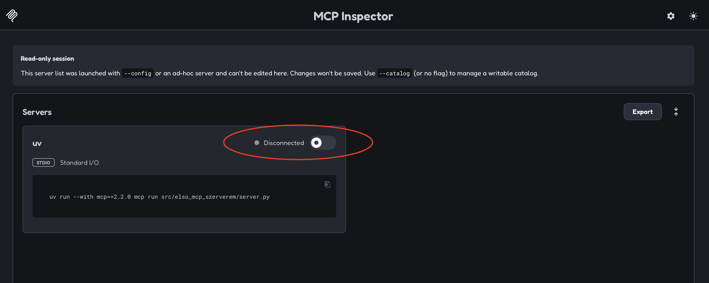

2. Ha sikeresen csatlakoztunk az MCP szerverünkhöz, a státusz jelző zöldre vált, és az Inspector felületén elérhetők lesznek az MCP szerverünkön található eszközök, erőforrások és promptok.

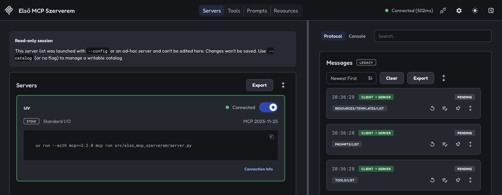

#### Eszköz tesztelése

1. Győződj meg róla, hogy az MCP szerverhez csatlakoztál az Inspector felületén.
2. Az oldal tetején kattints a **Tools** fülre. Itt találhatók az MCP szerverünkön elérhető eszközök, amelyeket tesztelhetünk. Ha nem látoda eszközöket, akkor kattintsd át a **Paginated** kapcsolót.

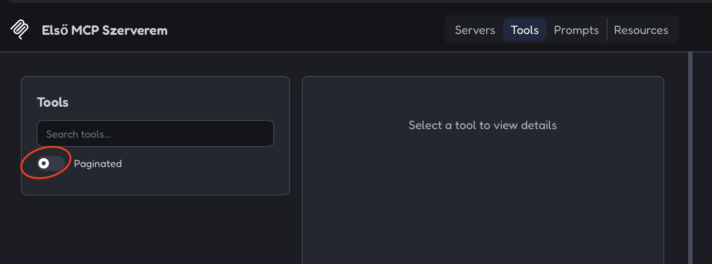

3. Ekkor megjelenik az MCP szerverünkön elérhető eszközök listája és kezdődhet is a tesztelés.

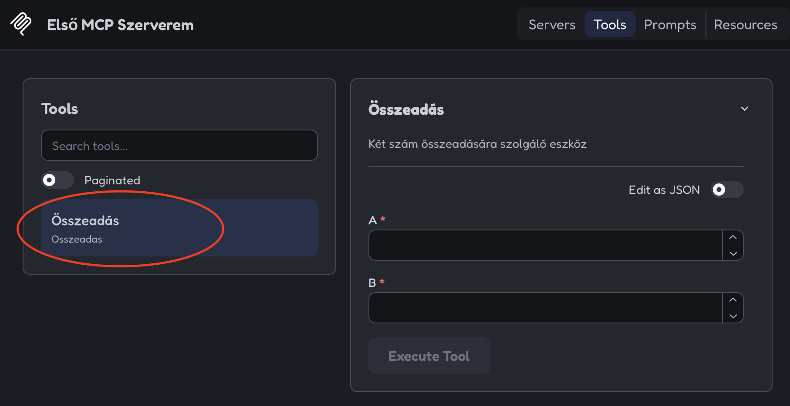

4. Az **Összeadás** eszköz tesztelése egyszerű: kattints az eszközre, add meg a szükséges bemeneti értékeket, majd indítsd el a tesztet.

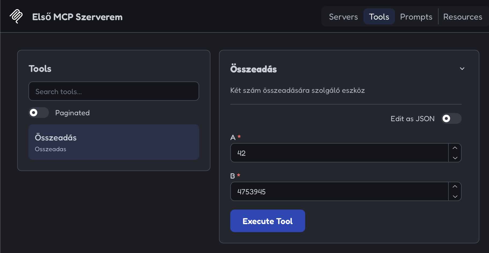

5.  Az eredmény megjelenik az Inspector felületén.

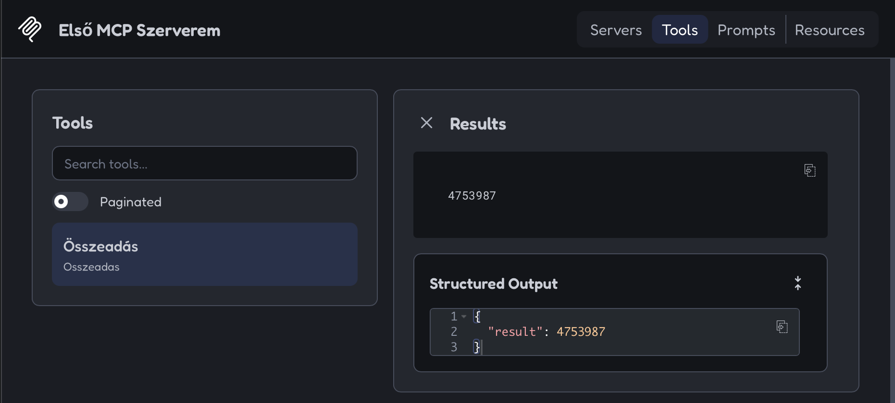

#### Erőforrás tesztelése

1. Győződj meg róla, hogy az MCP szerverhez csatlakoztál az Inspector felületén.

2. Az oldal tetején kattints a **Resources** fülre. Itt találhatók az MCP szerverünkön elérhető erőforrások, amelyeket tesztelhetünk.

3. Válaszd ki a tesztelni kívánt erőforrást és kattints rá a részletek megtekintéséhez és a tesztelés elindításához. Mi most a **Webshop logfájl beolvasása (erőforrás)** erőforrást fogjuk tesztelni.

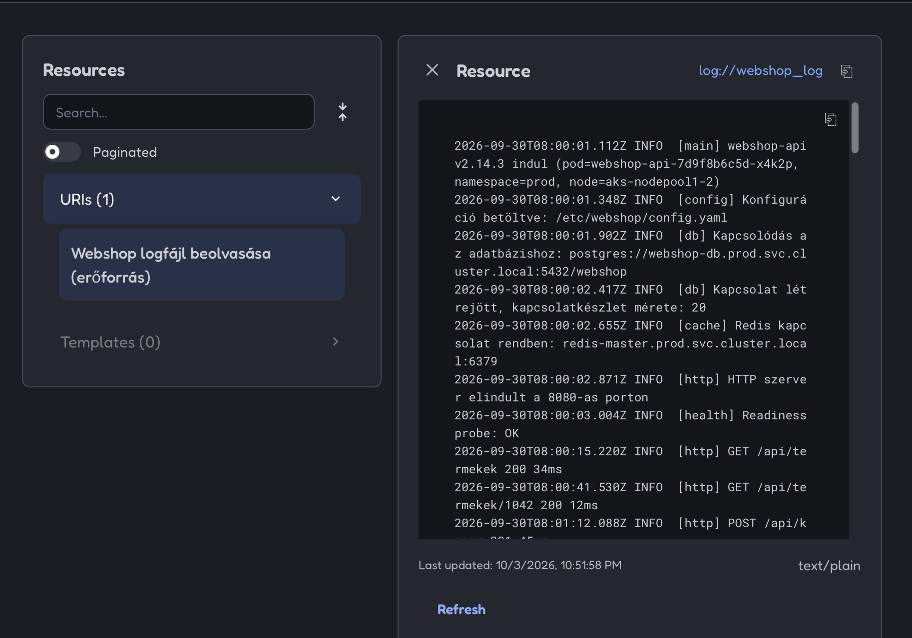

#### Prompt tesztelése

1. Győződj meg róla, hogy az MCP szerverhez csatlakoztál az Inspector felületén.
2. Az oldal tetején kattints a **Prompts** fülre. Itt találhatók az MCP szerverünkön elérhető promptok, amelyeket tesztelhetünk.
3. Válaszd ki a tesztelni kívánt promptot és kattints rá a részletek megtekintéséhez és a tesztelés elindításához. Mi most a **Incidens jelentés (prompt)** promptot fogjuk megtekinteni.
4. Miután rákattintottunk a nevére, láthatjuk a teljes prompt-ot.

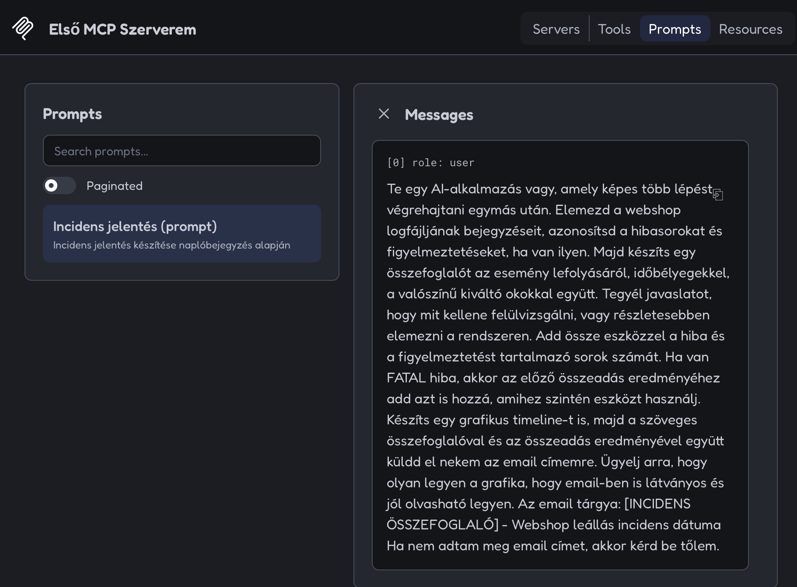

### Claude Desktop alkalmazás integrációja

MCP szervert több különböző alkalmazással is integrálhatunk, például a Claude Desktop, Cursor, ChatGPT, GitHub Copilot, stb. alkalmazással. Az integráció lehetővé teszi, hogy az MCP szerverünkön található eszközöket, erőforrásokat és promptokat közvetlenül a Claude Desktop vagy más integrált alkalmazások felületéről érjük el és teszteljük.

#### Konfigurációs fájl megnyitása

1. Nyisd meg a Claude Desktop alkalmazást.
2. Navigálj az alkalmazás beállításaihoz, és keresd meg a **Developer** menüt.
3. A megnyíló panelen kattints az **Edit config** gombra.
4. Ekkor fájlkezelőben megnyílik a mappa amely tartalmazza a Claude Desktop konfigurációs fájljait. Itt keresd meg és nyisd meg a `claude_desktop_config.json` fájlt és nyisd meg szerkesztésre.

#### Integráció lépései

Amikor a fájl nyitva van egy szerkesztőben keress rá a `"mcpServers"` kulcsra. Ha nem létezik, akkor folytad a következő lépéssel. Ha létezik, akkor a követlező lépést ugord át.

##### mcpServers szekció hozzáadása

1. Görgess le a konfigurációs fájl aljára és keresd meg az utolsó záró kapcsos zárójelet (`}`).
2. A záró kapcsos zárójel elé illeszd be a következő szekciót:

```json
  "mcpServers": {
    "Első MCP Szerverem": {
      "command": "/opt/homebrew/bin/uv",
      "args": [
        "--directory",
        "<A_TE_HELYI_ELERESI_UTVONALAD>/trn-ai-mcp/elso-mcp-szerverem",
        "run",
        "mcp",
        "run",
        "src/elso_mcp_szerverem/server.py"
      ]
    }
  }
```

3. A **<A_TE_HELYI_ELERESI_UTVONALAD>** helyére írd be a saját helyi elérési útvonaladat, ahol a `trn-ai-mcp/elso-mcp-szerverem` mappa található.
4. Mentsd el a fájlt és indítsd újra a Claude Desktop alkalmazást, hogy az új beállítások érvénybe lépjenek.

##### mcpServers szekció bővítése

1. Ha az **mcpServers** szekció már létezik a konfigurációs fájlban, akkor új szerver hozzáadásához egyszerűen másold le a meglévő szerver beállításait a `"mcpServers"` szekción belül a meglévő elé vagy mögé, az alábbi módon:

```json
  "mcpServers": {
    "Már létező MCP Szerver": {
      "command": "/opt/homebrew/bin/uv",
      "args": [
        "--directory",
        "<VALAMI ELERESI UT>",
        "run",
        "mcp",
        "run",
        "<VALAMI_PYTHON_FAJL-ELERESI_UTJA>"
      ]
    },
     "Első MCP Szerverem": {
      "command": "/opt/homebrew/bin/uv",
      "args": [
        "--directory",
        "<A_TE_HELYI_ELERESI_UTVONALAD>/trn-ai-mcp/elso-mcp-szerverem",
        "run",
        "mcp",
        "run",
        "src/elso_mcp_szerverem/server.py"
      ]
    }
  }
```

2. A **<A_TE_HELYI_ELERESI_UTVONALAD>** helyére írd be a saját helyi elérési útvonaladat, ahol a `trn-ai-mcp/elso-mcp-szerverem` mappa található.
3. Mentsd el a fájlt és indítsd újra a Claude Desktop alkalmazást, hogy az új beállítások érvénybe lépjenek.

#### MCP szerver ellenőrzése Claude Desktop alkalmazásban

1. Nyisd meg a Claude Desktop alkalmazást.
2. Navigálj az alkalmazás beállításaihoz, és keresd meg a **Developer** menüt.
3. A megnyíló panelen látnod kell az MCP szerveredet.

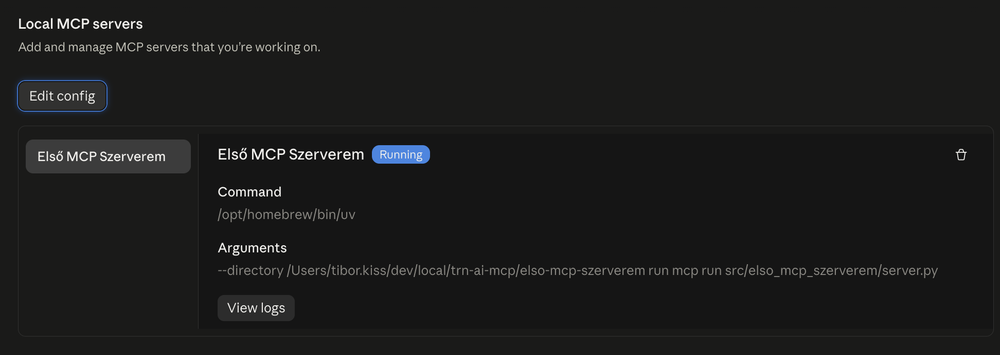

#### Kapcsolatok (Connections) ellenőrzése

1. Nyisd meg a Claude Desktop alkalmazást.
2. Navigálj az alkalmazás beállításaihoz, és keresd meg a **Connections** menüt.
3. A megnyíló panelen látnod kell az MCP szerver nevét. Kattints rá a részletek megtekintéséhez.
4. A megnyíló panelen láthatod az MCP szerverhez kapcsolódó eszközöket, a m esetünkben az \*_Összeadást_.

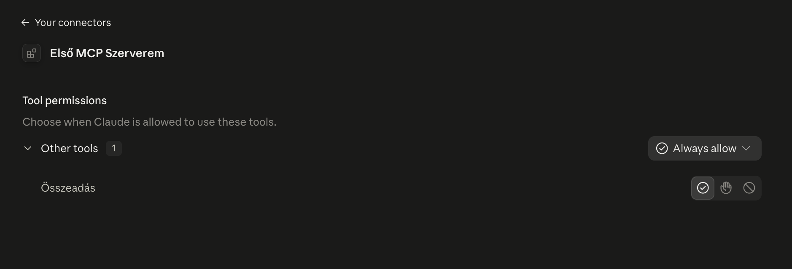

### Hibakezelés

Ha a konfiguráció közben valami hiba lépne fel, páldául elgépelted az elérési utat, akkor a Claude Desktop alkalmazás indításakor és a Developer menüben is hibaüzenetet fog megjeleníteni, és a módosítások nem lépnek érvénybe. Ilyen esetben ellenőrizd a konfigurációs fájlban megadott elérési utakat, és javítsd a hibákat.

1. Tegyük fel, hogy a py fájl nevét elírtuk: `"src/elso_mcp_szerverem/servers.py"`
2. Amikor elindítod a Claude Desktop alkalmazást, megkapod a hibaüzenetet:

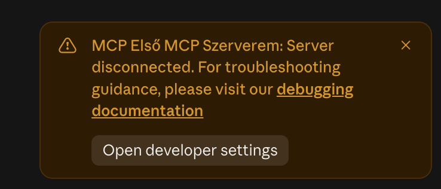

3. Amint látod ad segítséget is, hogy közvetlenül a **Developer** menübe lépj.
4. Itt is láthatod a hiba részleteit és meg tudod nyitni a logokat, ahol még részletesebben ellenőrizheted a problémát.

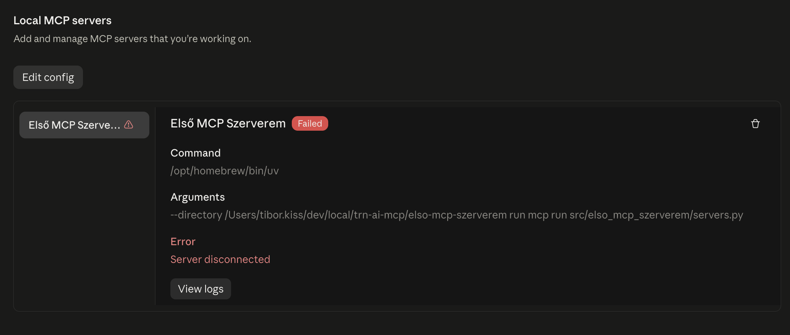

5. Ez alapján hamar rájöhetsz, hogy mi a hiba, és javíthatod a konfigurációs fájlban. Helyesen: `"src/elso_mcp_szerverem/server.py"`
6. Indítsd újra a Claude Desktop alkalmazást a módosítások érvénybe léptetéséhez.

### Gmail kapcsolat hozzáadása és aktiválása Claude Desktop alkalmazáshoz

Az MCP szerverünk komplexebb teszteléséhez telepítjük, majd aktiváljuk a Gmail kapcsolatot a Claude Desktop alkalmazásban.

1. Nyisd meg a Claude Desktop alkalmazást.
2. Navigálj az alkalmazás beállításaihoz, és keresd meg a **Connections** menüt.
3. A **Connections** felirat mellett kattints a \*_Discover_ fülre.
4. Keresd meg a **Gmail** kapcsolatot a listában, és kattints a **+** gombra a telepítéshez.

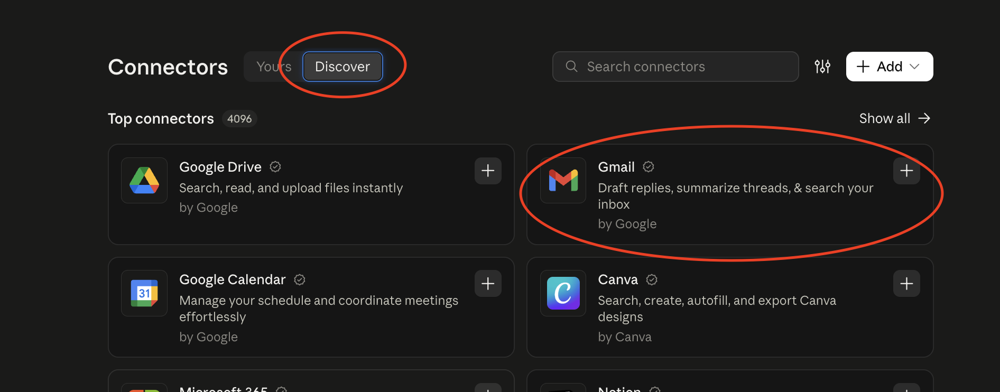

5. Ekkor egy böngészőablakban megnyílik a kapcsolati varázsló. Ennek elő lépése, hogy megkérdezi, hogy véglegesíted-e a kapcsolat beállításait. Ha igen, akkor kattints a **Continue connectiong** gombra.

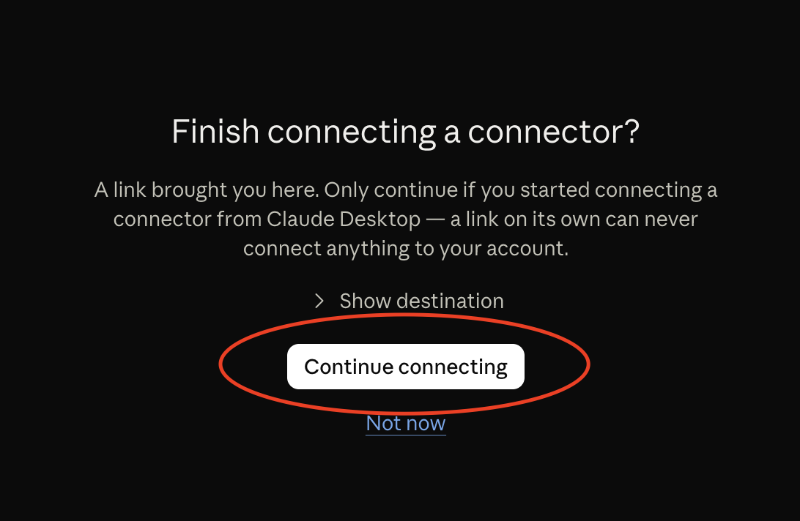

6. A következő lépésben ki kell választanid azt a Google fiókot, amelyet a Gmail kapcsolatban használni szeretnél. Vagy a meglévőek kközül választasz, vagy be is jelentkezhetsz egy új fiókkal.

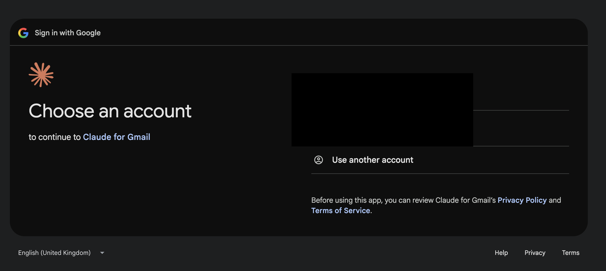

7. Miután kiválasztottad a Google fiókot, a kapcsolati varázsló még 2 lépésben kér bizonyos jogosultságokat a Gmail kapcsolat működéséhez. Mindkét lépésben kattints a **Tovább** gombra a jogosultságok megadásához.


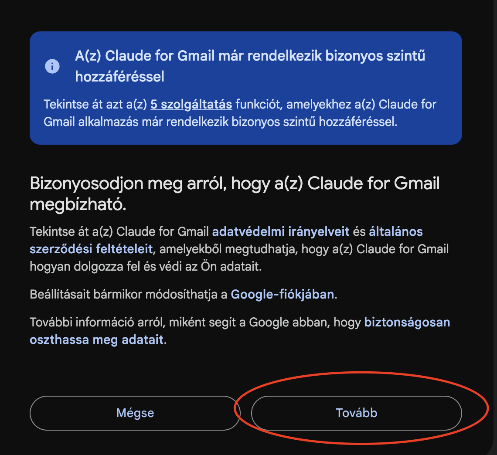

8. Miután mindkét lépésben megadtad a szükséges jogosultságokat, a Gmail kapcsolat aktiválódik. Ki is írja, hogy **Connected**. Ezután vagy visszaírányít automatikusan a Claude Desktop alkalmazásra, vagy ezt tes is megteheted az **Open desktop app** gombra kattintva.

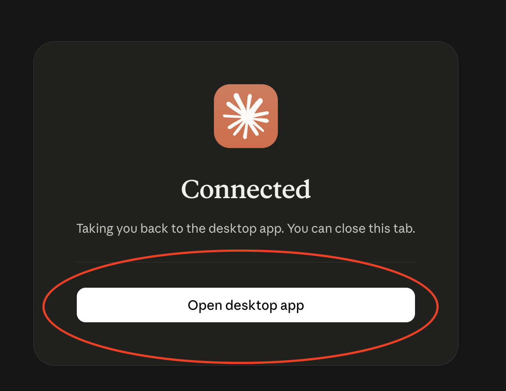

9. Innnen a Claude Desktop alkalmazásban a **Connections** menüben láthatod, hogy a Gmail kapcsolat aktív és csatlakoztatva van.


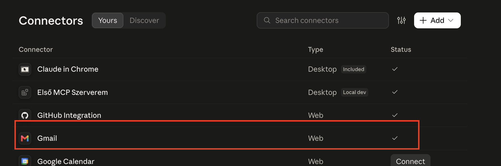

Ezzel sikeresen hozzáadtad és aktiváltad a Gmail kapcsolatot a Claude Desktop alkalmazásban.

### MCP szerver tesztelése Claude Desktop alkalmazásban

Mindegyik funkcióját (eszköz, erőforrás, prompt) tesztelheted a Claude Desktop alkalmazásban. Én most a legösszetettebbet írom le lépésről lépésre. Ebben a példában a **prompt**-ot felhasználva (rendszeresen végrehajtandó feladarta utasítom az AI-t) kérem meg, hogy elemezze az **erőforrásban** lévő hibalogot. Az alapján készítsen egy incidens jelentést. Az incidensen számát összegezze az **Összeadás** **eszközzel**. Végül ezt az egészet küldje el az email címemre.

Ezzel egy multi-agent-es MCP-s tesztet hajtottál végre a Claude Desktop alkalmazásban.

Lépések a teszteléshez:

1. Nyisd meg a Claude Desktop alkalmazást.
2. Nyiss egy chat ablakot a Claude Desktop alkalmazásban.
3. Kattints a **+** gombra, majd a **Connections** menüpontra.
4. Itt válaszd az **Add from Első MCP Szerverem** lehetőségből az **Incidens jelentés (prompt)** opciót.

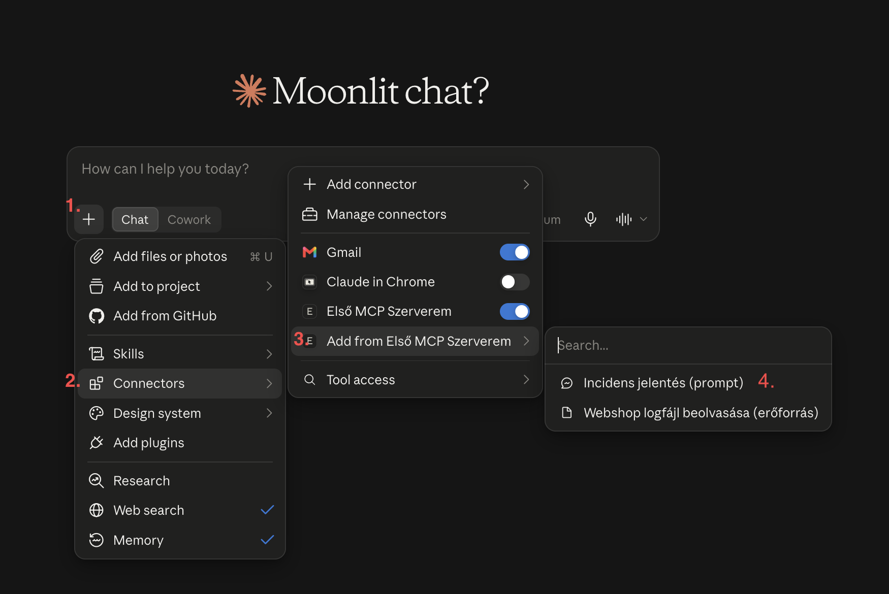 5. Ezzel hozzáadtad az **Incidens jelentés (prompt)** kapcsolatot a chat ablakhoz. 6. Mivel a Claude Desktop nem támogatja megfelelően az erőforrások közvetlen kezelését, így azt is kézzel kell hozzáadnod a chat ablakhoz. 7. Ehhez kattints a **+** gombra, majd a **Connections** menüpontra. 8. Itt válaszd az **Add from Első MCP Szerverem** lehetőségből az **Webshop logfájl beolvasása (erőforrás)** opciót.

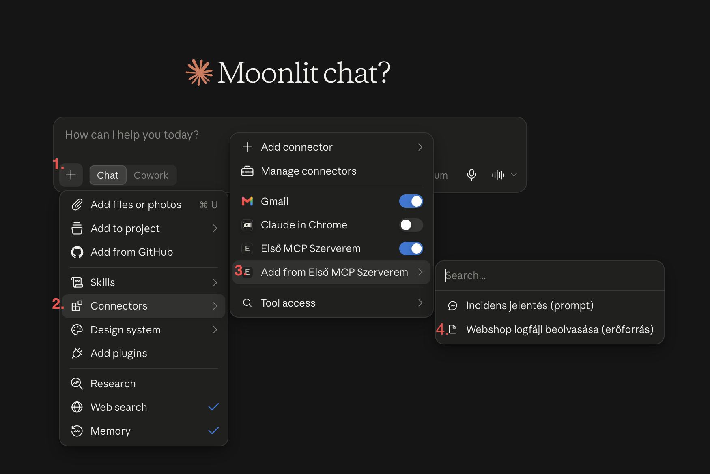 9. Ezzel hozzáadtad a **Webshop logfájl beolvasása (erőforrás)** kapcsolatot a chat ablakhoz. 10. Most már mindkét szükséges kapcsolat hozzá van adva a chat ablakhoz, és elkezdheted a multi-agent-es MCP tesztet a prompt segítségével.

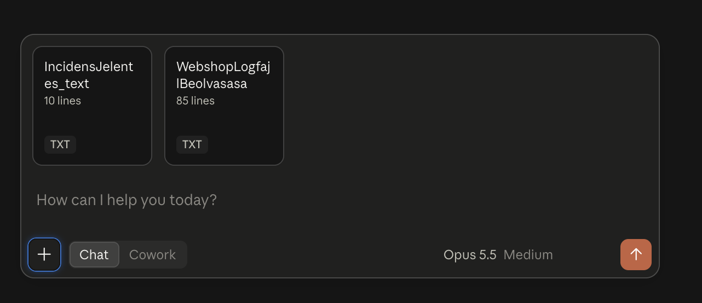

11. Nem kell semmit beírnod, hiszen a prompt készen be lett töltve. Csak üss **Enter**-t a chat ablakban a multi-agent-es MCP teszt elindításához.
12. Figyeld meg az AI válaszait, és ellenőrizd, hogy az incidens jelentés elkészült-e, valamint mit reagál a modell.

## 4. Integráció egyéb alkalmazásokkal

### ChatGPT Codex

Ebben az esetben parancssorból hozzáadni a legegyszerűbb.

1. Nyisd meg a terminált a számítógépeden.
2. Ellenőrizd, hogy a Codex telepítve van-e a számítógépeden a következő paranccsal:

```bash
codex --version
```

3. Ha a Codex nincs telepítve, telepítsd a következő paranccsal:

```bash
npm install -g @openai/codex
```

4. Ellenőrizd, hogy a Codex telepítése sikeres volt-e a a 2-es pont szerint,
5. Kérezd le a telepített MCP-k listáját a következő paranccsal:

```bash
codex mcp list
```

6. Ha megnézzük, nincs benne a mi MCP szerverünk. Akkor adjuk hozzá a következő paranccsal:

```bash
codex mcp add elso_mcp_szerverem -- \
  /opt/homebrew/bin/uv \
  --directory /Users/tibor.kiss/dev/local/trn-ai-mcp/elso-mcp-szerverem \
  run mcp run src/elso_mcp_szerverem/server.py
```

Természetesen a fenti parancsokat a saját rendszeredhez és a telepítési útvonalakhoz kell igazítani.

7. Futtatás után ezt kell kiírnia: `Added global MCP server 'elso_mcp_szerverem'.`
8. Ellenőrizd újra a telepített MCP-k listáját a `codex mcp list` paranccsal, hogy megbizonyosodj róla, hogy az új MCP szerver hozzáadása sikeres volt. A Codex konfigurációs fájlja, ami ezeket a beállításokat tartalmazza itt található: `~/.codex/config.toml`.

9. Teszteléshez lépj be a codex parancssorba a következő paranccsal:

```bash
codex
```

10. A codex parancssorban írd be a következő promptot az MCP szerver teszteléséhez:

```bash
Használd az Osszeadas eszközt: mennyi 1234567 + 7654321?
```

_Megjegyzés: Ha jóváhagyást kér az MCP eszköz használatához, akkor add meg az **Allow** vagy az \*Allow for this session\*\* lehetőséget választva._

11. Látszik, hogy meghívta a **Összeadás** eszközt, és a helyes eredményt adta vissza.

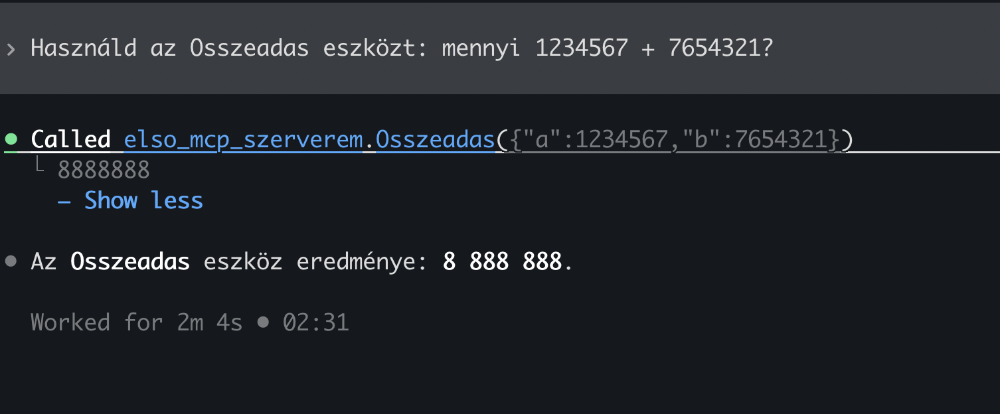

